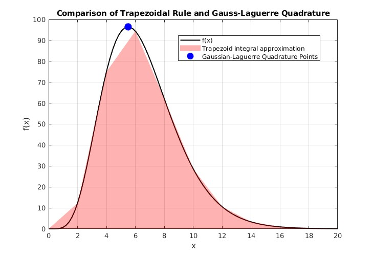
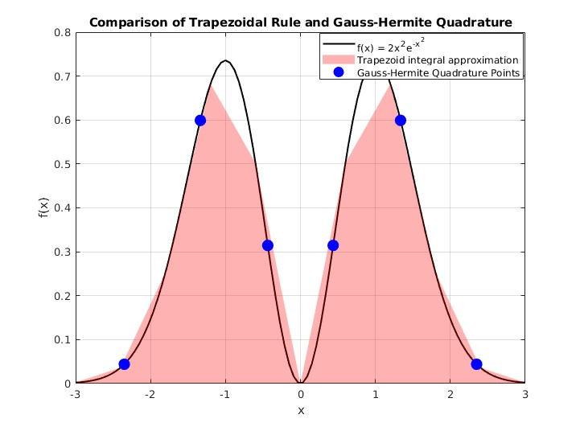

# Illustration-of-Gaussian-quadrature-methods-and-application-to-state-estimation
Illustration of Gaussian/Laguerre/Legendre quadrature methods and application to state estimation 

### Files:
- "Gauss_Laguerre_quadrature.m":
- "Gauss_Hermite_quadrature.m"
- "cubature.m" -> to come
  

### Contents:

I. Application of Gauss quadrature methods to approximate the computation of non trivial integral involving gaussian law or deacreasing exponential on finite or infinite support: graphics illustrations and numerical outcomes on different examples. 

II. Application to estimate mean and covariance of uncertain state undergoing nonlinear transformations.

-> to come

### Figures
 </img>

 </img>

### Sources:
- For Gaussian quadrature methods: https://en.wikipedia.org/wiki/Gaussian_quadrature
- For Gauss-Laguerre quadrature: https://en.wikipedia.org/wiki/Gauss%E2%80%93Laguerre_quadrature
- For Gauss-Hermitte quadrature: https://en.wikipedia.org/wiki/Gauss%E2%80%93Hermite_quadrature
- For Gauss-Legendre quadrature : https://en.wikipedia.org/wiki/Gauss%E2%80%93Legendre_quadrature
